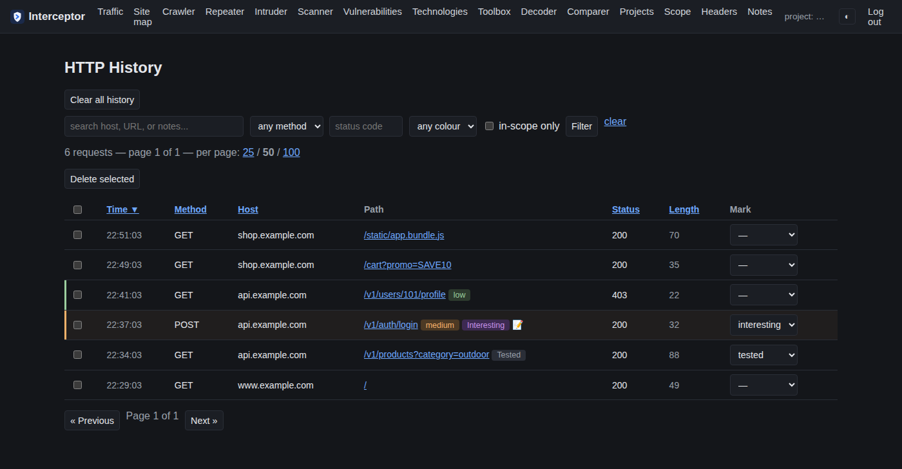
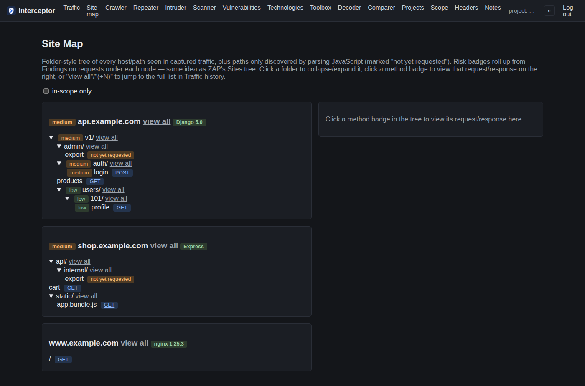
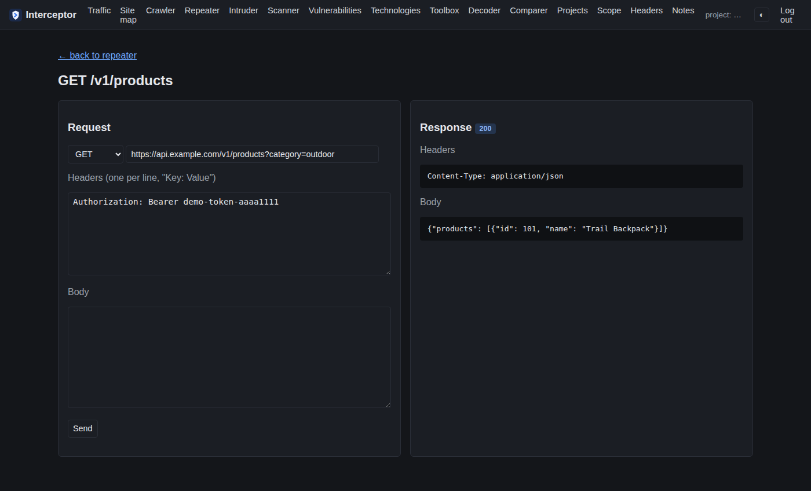
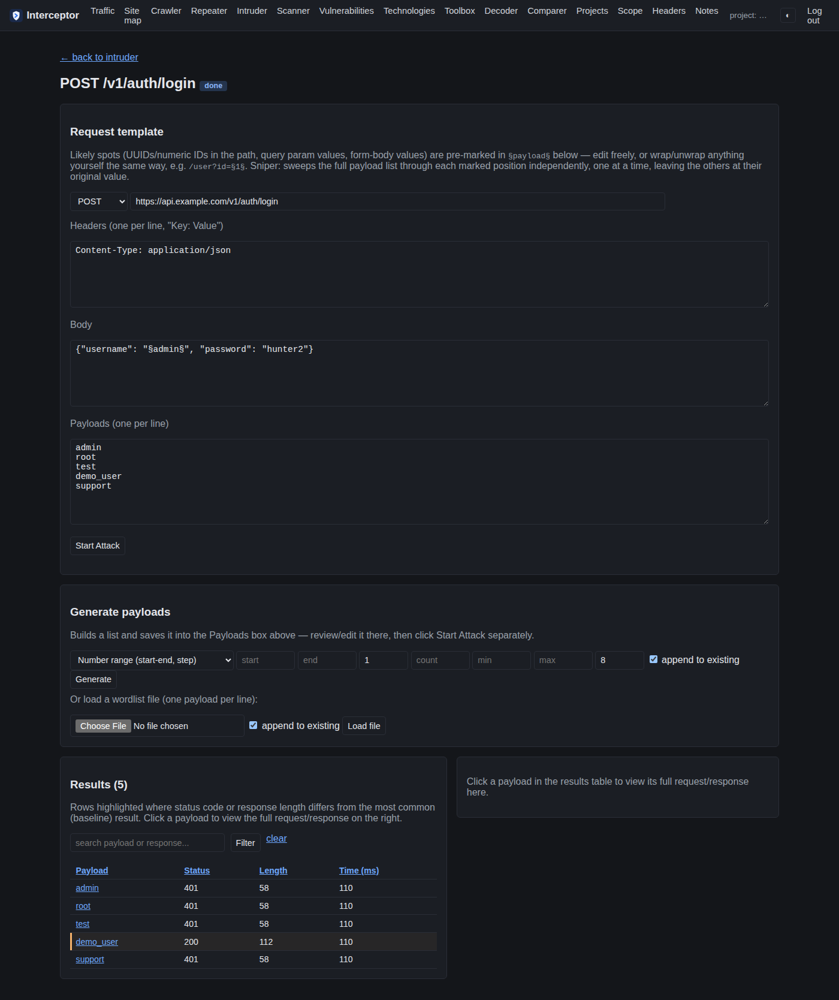
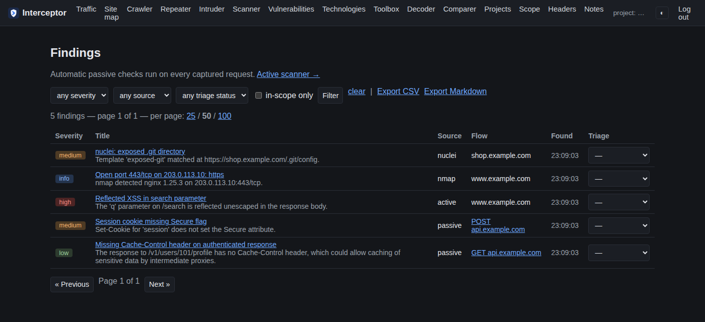
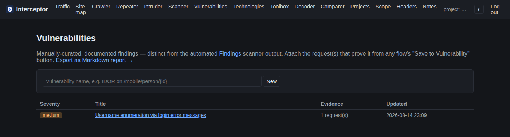
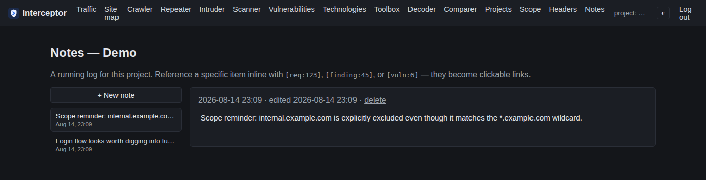

# Features

- **Intercepting proxy + HTTP history** — mitmproxy captures every request/
  response into Django. Search, filter, sort, and paginate history; mark
  requests Tested/Interesting with notes; scope-aware capture mode.
- **Open Browser** (`./browse.sh`) — isolated Chromium profile pre-pointed
  at the proxy, Burp-style. Run on your desktop, not in a container.
- **Site map** — folder-style host/path tree merged with JS-discovered
  endpoints, with risk badges rolled up from Findings, ZAP Sites-tree style.
- **Repeater** — edit and resend a captured request, response side-by-side,
  auto-recalculated `Content-Length`.
- **Intruder** — Sniper attack with auto-marked `§payload§` insertion
  points, typed/generated/wordlist payloads, sortable/filterable results
  with anomaly highlighting.
- **Active scanner** — opt-in, scope-checked: missing security headers,
  reflected-XSS and error-based-SQLi probes, directory/file brute force.
  Repeater/Intruder/Active Scanner sends are throttled to 1 req/s.
- **Toolbox** — `nmap` scans, `searchsploit` (~48k exploits), and `nuclei`
  (~13.5k templates) integration, auto-chained from detected
  services/technologies, all scope-checked and parsed into Findings.
- **Crawler** — rate-limited, concurrency-controlled spider with randomized,
  human-like timing; ignores `robots.txt` on purpose; captured pages flow
  into Traffic/Site map like proxied requests.
- **Technology detection** — passive fingerprinting (hand-written signatures
  plus a Go `techdetect` wrapper around `wappalyzergo`) from data already
  captured, no extra requests.
- **Decoder / Comparer** — Base64/URL/HTML/hex encode-decode and a
  line-by-line text diff, both stateless.
- **Passive scanner** — automatic checks on every flow (headers, reflected
  params, error pages, mixed content, interesting params, leaked secrets),
  driving severity-colored Findings (own detail page per finding) with
  triage status and CSV/Markdown export.
- **Vulnerabilities** — manually-curated report workspace: write up a
  vuln, attach proof requests, export the project as a Markdown report.
- **Notes** — Notion-style per-project log: sidebar of notes, click one to
  open and edit inline (autosaves), reference a request/finding/
  vulnerability with `[req:123]`/`[finding:45]`/`[vuln:6]` for a link
  straight to it.
- **Scope enforcement** — every traffic-sending feature checks the active
  project's scope first; entries can be marked as exclusions so a wildcard
  can carve out specific subdomains.
- **Custom headers** — per-project, auto-injected into outbound traffic
  (e.g. bug-bounty program identification); can append to an existing
  header's value instead of only setting it when missing (for a required
  User-Agent suffix, say).
- **Projects** — name/description/rules live on the project and stay
  editable; a full-setup page collects scope, headers, and rules together
  when creating one. Delete / export / import with ID remapping.
- **Light/dark theme**, toggled from the header.

See each feature's code/templates for implementation details.

## Screenshots

Captured from a throwaway demo project with fake `example.com` data, not a
real engagement.

**Traffic history**

**Site map**

**Repeater**

**Intruder** — anomalous result (different status/length) highlighted

**Findings**

**Vulnerabilities**

**Notes** — with `[req:N]`/`[finding:N]`/`[vuln:N]` cross-references

